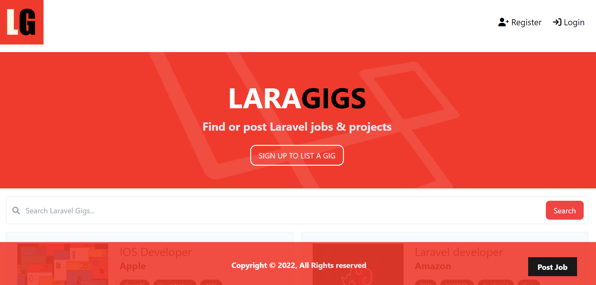

# LaraGigs
LaraGigs is a web application built using the Laravel PHP framework.
 During the development of this project, I learned the basics of Laravel through tutorials 
 on YouTube and gained hands-on experience with the framework.
 The result is a fully functional CRUD (Create, Read, Update, Delete) application,
 which showcases my knowledge and understanding of these technologies.
 The project allowed me to further develop my skills and become more familiar with the Laravel ecosystem.
 Overall, LaraGigs was a valuable learning experience and has helped me to become a 
 more well-rounded web developer thanks to the knowledge I gained from YouTube tutorials.
## Screenshot

